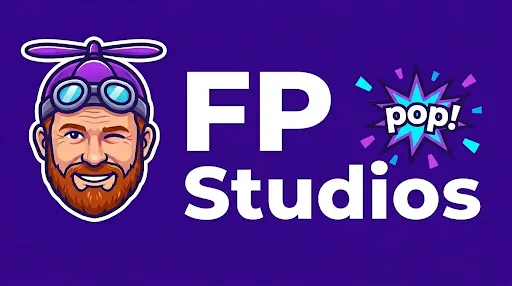

<p align="center">
  
</p>

<h1 align="center">FokkerPop</h1>

<p align="center">
  <em>A Twitch overlay app built for streamer <strong>LilFokker</strong> — spiritual successor to PolyPop.</em><br>
  Everything runs locally on your PC. Nothing goes to the cloud.
</p>

<p align="center">
  <a href="../../releases/latest"></a>
  <a href="../../releases"></a>
  <a href="../../issues"></a>
</p>

<hr>


## Features

- **Live alerts** — follows, subs, gifted subs, bits, raids, hype trains
- **Reactive Character** — mascot sprite that reacts to energy and events
- **Sound Effects Engine** — link custom sounds to any alert or effect
- **Balloons, fireworks, confetti, sticker rain** — CSS + canvas animations
- **3D dice tray** — full physics-driven multi-die rolls (Three.js + cannon-es), themable face textures, percentile (D100) rendering as paired tens/units
- **Fokker Studio** — visual flow editor (drag-and-wire nodes) for binding any event to any effect, with template-evaluated branches and match nodes
- **PolyPop importer** — Setup → Import from PolyPop pulls channel-point redeems, chat aliases, and audio references out of a `.pop` file in one click
- **Crowd energy meter** — builds up during events, drives ambient glow effects
- **Combo detector** — recognises sub and bit trains and signals them with a banner
- **Config Editor** — manage goals, redeems, and chat-command aliases directly in the dashboard
- **Layout editor** — drag widgets into place, toggle visibility, reset to shipped defaults from the dashboard
- **Leaderboards** — rotating display of top bits donators and gift sub kings
- **Auto-Updater** — optional background install of new releases; gracefully waits if you're streaming
- **Twitch Health** — real-time status of your Twitch connection in the sidebar
- **Twitch Simulator** — offline test bed to simulate specific redeems, cheers, and alerts
- **Demo mode** — press `?demo=1` in the overlay URL to see a full stream scenario

## Quick Start (Windows)

1. Download the latest `FokkerPop-vX.X.X-windows.zip` from the [Releases page](../../releases)
2. Extract it anywhere — Desktop, `C:\Apps`, wherever you like
3. Double-click **`start.bat`**
4. The dashboard opens automatically in your browser
5. Go to the **Setup** tab and paste your Twitch credentials (see below)
6. In OBS: **Add Source → Browser Source** → URL `http://localhost:4747/` → 1920×1080

Node.js is bundled inside the zip. Nothing else to install.

## Twitch Setup

You need a Twitch application to receive live events:

1. Go to [dev.twitch.tv/console/apps](https://dev.twitch.tv/console/apps) → **Register Your Application**
2. Name: anything (e.g. `FokkerPop`)
3. OAuth Redirect URL: `http://localhost:4747/auth/callback`
4. Category: **Chat Bot**
5. Copy the **Client ID** and generate a **Client Secret**
6. Paste both into the Dashboard → **Setup** tab → click **Connect**
7. Approve the Twitch permissions popup (the window will close itself when done)

Your `settings.json` is created automatically and is never uploaded anywhere.

## Updating

The dashboard checks GitHub for new releases every 30 minutes. When one is
available, a gold banner appears at the top — click it to install.

You can also:
- **Setup → Check for Updates**: trigger a check right now.
- **Config → Auto-Install Updates**: opt-in to fully automatic background
  installs. If you're streaming when a release lands, install waits until
  your stream ends.

Manual install (no dashboard needed):

1. Download `FokkerPop-Updater-vX.X.X.exe` from the [Releases page](../../releases)
2. Place the file **inside** your current `FokkerPop` folder
3. Double-click it and click **Yes** to extract/overwrite
4. Your `settings.json`, `goals.json`, `commands.json`, `redeems.json`,
   `flows.json`, `widgets.json`, and uploaded assets are **preserved**.
5. Run `start.bat` as usual.

Alternatively, you can download the `.zip` and manually extract it over your existing folder.

## Support & Feedback

If you run into a bug or have a cool idea for a new feature:

1.  Go to the **[Issues Tab](../../issues)**
2.  Click **"New Issue"**
3.  Choose **🐛 Bug Report** or **🚀 Feature Request**
4.  Fill in the blanks!

I've added professional templates to make it nice and easy for you to send us what we need to help out.

## Customisation

### Sound Effects
Drop your WAV or MP3 files into `assets/sounds/`. You can then select these sounds from the dropdown menus in the **Config** tab of the dashboard. Use the volume slider in the **Live** tab to adjust levels.

### Character Mascot
Place your character images in `characters/lilfokkermascot/`. The app
looks for these specific basenames and tries `.gif`, `.png`, `.webp`, and
`.jpg` in that order — so any of those formats work:
- `idle`: shown when energy is low (0-24%)
- `active`: shown when energy is moderate (25-74%)
- `hype`: shown when energy is high (75-98%)
- `explosion`: shown during crowd explosions (99-100%)

### Stickers
Drop PNG or GIF stickers into `assets/stickers/` to have them appear during the "Sticker Rain" effect.

## Troubleshooting

### "Module 'ws' missing" or "node_modules missing"
This happens if you downloaded the **Source Code** zip from GitHub instead of the **Release** zip.
**Fix:** Go to the [Releases page](../../releases) and download the file ending in `-windows.zip`.

### Dashboard says "Twitch Offline" or "Twitch Error"
1. Check your **Setup** tab. Ensure your Client ID and Client Secret are correct.
2. Click **Connect** again to refresh your tokens.
3. Ensure your Twitch App has the Redirect URL set to `http://localhost:4747/auth/callback`.

### Sounds aren't playing
1. Check the volume slider in the Dashboard's **Live** tab.
2. Ensure the sound filename in the **Config** tab exactly matches the file in `assets/sounds/`.
3. In OBS, check the Browser Source properties and ensure **"Control audio via OBS"** is NOT checked (unless you want to manage the volume in the OBS mixer).

## Configuration Files

All files live in your FokkerPop install root. They're created on first
boot from the matching `*.example.json` and preserved across updates.

| File | Purpose |
|------|---------|
| `settings.json` | Twitch + OBS credentials and tuning (never commit this) |
| `goals.json` | Stream goals — targets, metrics, rewards |
| `redeems.json` | Maps Channel Point reward titles → visual effects |
| `commands.json` | Maps `!chat` commands → redeems, with permission gating + cooldowns |
| `flows.json` | Fokker Studio's saved flow graphs (event → effect wiring) |
| `widgets.json` | Custom overlay widgets (counter, dice tray, leaderboard, etc.) |
| `state.json` | Live session state (subs/bits today, leaderboard, layout positions) |

## Architecture

```
Twitch EventSub WS
        │
        ▼
    eventsub.js  (normalises raw Twitch events)
        │
        ▼
      bus.js  (event bus with middleware pipeline)
        │
   ┌────┼────────────────────┐
   │    │                    │
enricher  combinator     throttler
(adds ts) (sub combos)  (rate limit)
                             │
                         router.js  (maps events → effects)
                             │
                    ┌────────┴────────┐
                    │                 │
               overlay.html      dashboard/
            (browser source)   (control panel)
```

## Security

- Server binds to `127.0.0.1` only — not accessible from your local network
- WebSocket server rejects any connection whose `Origin` isn't `127.0.0.1`/`localhost`
- HTTP cross-origin write protection on all mutating (non-GET) endpoints
- Path traversal guard on all HTTP file requests
- Atomic state writes (tmp + rename) with a `.bak` rotation so a crash mid-write can't corrupt your layout
- Four npm dependencies (`ws`, `three`, `cannon-es`, `matter-js`) — all vendored in release zips, no install step at runtime

## Development

```bash
npm install
npm run dev    # starts with --watch (auto-restart on file changes)
npm test       # HTML validator + unit tests (semver, dice, template engine)
```

Requires Node.js 18 or newer.
